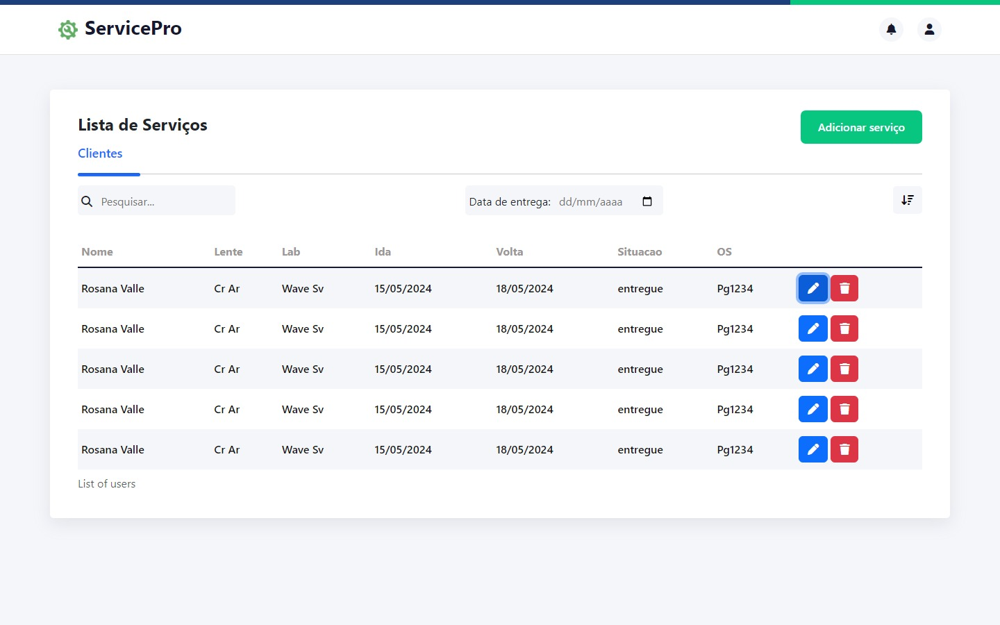

## Sobre o projeto

Este projeto está sendo desenvolvido para a minha empresa com o objetivo de automatizar o processo de envio de serviços para o laboratório. O objetivo final é melhorar o controle e a gestão dos serviços enviados, garantindo maior eficiência e precisão.

<h1>Service Pro</h1>

<h1>Tecnologias:</h1>

  <ul>
               <li>Node.js</li>
               <li>Express</li>
               <li>Mysql</li>  
               <li>Sequelize</li>
               <li>Ejs</li>
               <li>Bootstrap</li>
               <li>Sass</li>
  </ul>
